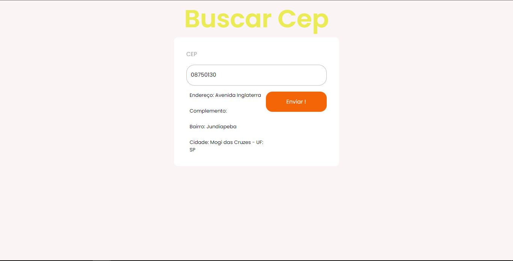
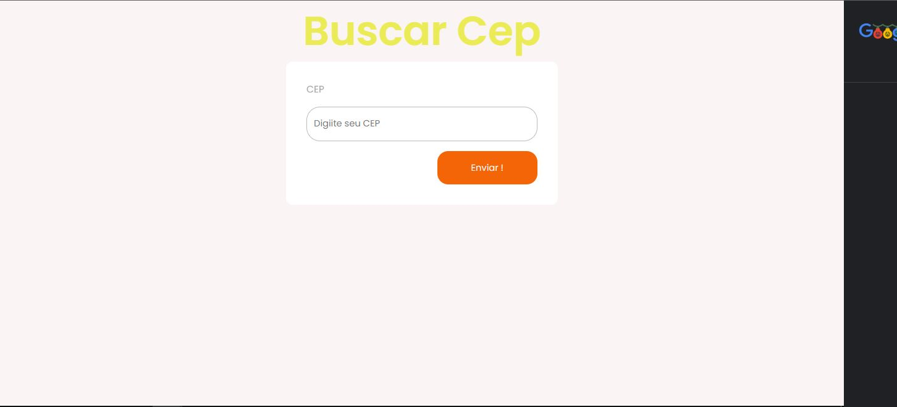
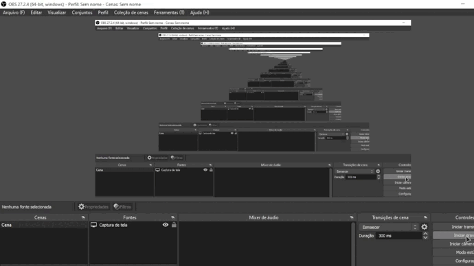

<h1 align="center">
   📨 Zip code finder 📨
</h1>

<h4 align="center">
  💻 
Zip search engine project, to train API consumption
</h4>

## Photo 🎴

   
    
   
    
   

   
   <a href="#on">On</a> .
   <a href="#roadmap">Roadmap</a> .
   <a href="#technologies">Technologies</a> .
   <a href="#photos">Photos</a> . 
   <a href="#author">Author</a>
 

   
## On ✔
     
     
   
  This Project was to train how to consume API 

   
   
## Roadmap 🗺

   
 Using (.then) I can use the API and manage to assemble projects that gain super powers,
it was really cool to learn a little more about certain JavaScript technology !! 

   
   
## Technologies 🚀

   <h3 align="center"> Tecnolgias usadas no projeto 🙃</h3>
 
   

- [JavaScript](https://www.javascript.com/)
- [HTML](https://developer.mozilla.org/pt-BR/docs/Web/HTML/Element/html/)  
- [CSS](https://developer.mozilla.org/pt-BR/docs/Web/CSS)  

 
 

## Author 🙋🏾‍♂️
   
 Hello, my name is João.   Follow me on <a href="https://www.linkedin.com/in/joaosoaressilva/" target="_blank">Linkedin</a> to see more about the projects I post.!

